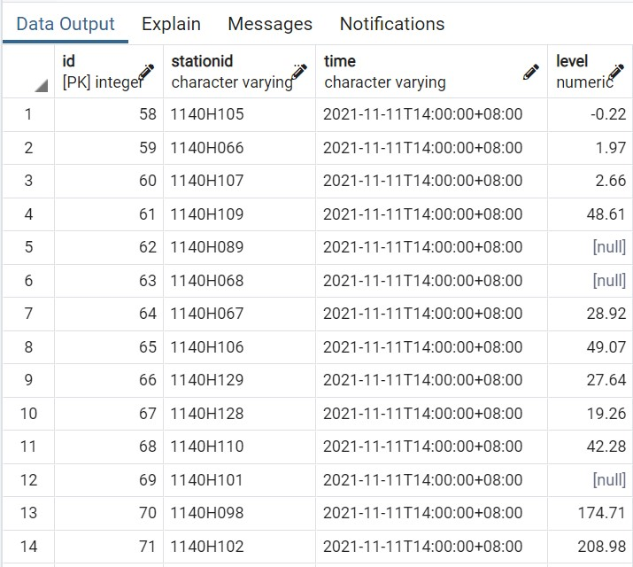
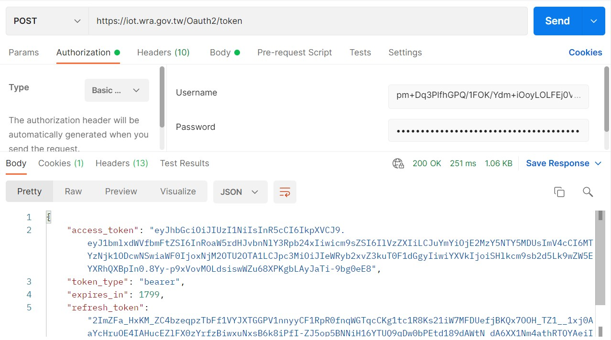
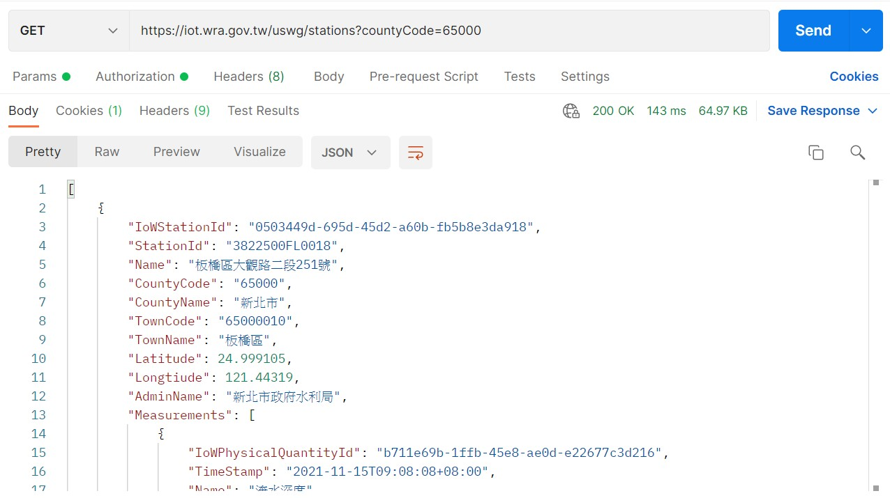

# **River station Project**

## **專案說明**
 
對比資料時間，相差二十小時以上即向資料網站發出請求取得token後，獲得水位站資料，並寫入其他資料。連接本地端postgreSQL資料庫，查找到每筆資料庫的資料，與api資料做對比，抓取資料進行更新。
 
 

## **環境說明**
 Windows 10 家用版；
 Python version 3.6.8

 

## **檔案說明**
 run.py 為撰寫之主要程式
 insert.py 第一次匯入本地資料庫之程式
 token.json 透過Postman取得的token
 log_result.json 顯示專案結果是否執行
 db.json 存放涉及隱私相關的資料；db_template.json為db.json的空模板
 basin_rain.json/basin_depth_boudary.json 讀取網站匯入的資料
 basin_depth_area.png 讀取網站匯入的圖片
 run.bat 執行主程式之批次檔
 requirements.txt存放虛擬環境下所設的套件

 

## **成果說明**
 
在PostgreSQL本地端資料庫匯入api取得的最新資料

以Postman程式顯示提出請求獲取token

取得token後所抓取的資料型態

